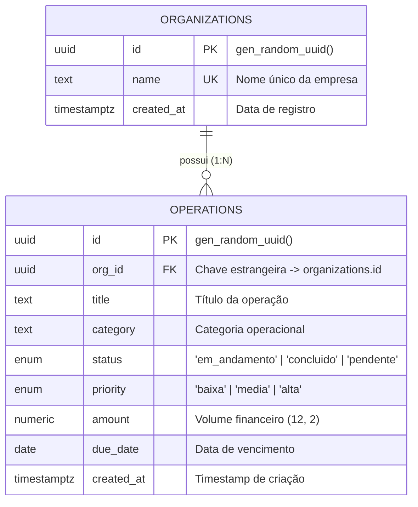

# 🏢 Enterprise Ops Dashboard — Painel de Gestão & Métricas Corporativas

> **Projeto de Portfólio Full-Stack Core**  
> Desenvolvido para demonstrar domínio sólido dos fundamentos de engenharia de software moderno: arquitetura relacional, queries de alta performance, sincronização bidirecional de estado via URL, mutações com Server Actions, validação estrita com Zod e visualização de dados analíticos.

---

## 🧭 Visão Geral

O **Enterprise Ops Dashboard** é uma aplicação completa de gestão operacional e financeira para médias e grandes corporações. Ele resolve problemas reais encontrados em sistemas de ERP e backoffice:

1. **Gargalo de Memória e Rede:** Em vez de carregar milhares de registros de uma vez no navegador, o sistema realiza paginação no banco com `LIMIT` e `OFFSET`, garantindo tempo de resposta constante independente do volume da base.
2. **Perda de Contexto e Filtros:** Ao contrário de dashboards que salvam filtros em variáveis voláteis do React (`useState`), este projeto sincroniza filtros, paginação e ordenação nos **Query Parameters da URL**, permitindo deep linking e preservando o histórico do navegador.
3. **Consistência Relacional:** Modelagem de dados profissional com integridade referencial (1:N entre Organizações e Operações) e constraints em banco.

---

## 🚀 Funcionalidades Principais

### 1. Painel de Indicadores (KPI Cards)
- **Total de Operações:** Volume total de demandas cadastradas.
- **Operações Concluídas:** Total de demandas finalizadas com taxa percentual de resolução.
- **Taxa de Resolução (%):** Eficiência de conclusão em tempo real.
- **Volume Financeiro (R$):** Montante financeiro total sob gestão, formatado na moeda local brasileira.

### 2. Gráficos Analíticos Interativos (Recharts)
- **Distribuição por Categoria (Gráfico de Barras):** Alocação de recursos financeiros e densidade operacional agrupados por área (TI, Jurídico, Logística, etc.).
- **Evolução Mensal (Gráfico de Área Temporal):** Tendência de compromissos e entregas ao longo dos meses com gradiente visual e tooltips detalhados.

### 3. Tabela de Dados Corporativa com Server-Side Pagination
- **Paginação Real no Banco:** Navegação por páginas numéricas, primeira/última e seletor de itens por página (5, 8, 10, 20).
- **Ordenação Dinâmica:** Ordenação crescente/decrescente clicando nos cabeçalhos das colunas (Título, Organização, Categoria, Status, Prioridade, Volume e Vencimento).
- **Filtros Múltiplos:** Busca textual por termo, filtro por Status (`Em Andamento`, `Concluído`, `Pendente`), por Prioridade (`Alta`, `Média`, `Baixa`), por Categoria e por Empresa/Organização.
- **Chips de Filtros Ativos:** Limpeza individual de filtros com um clique ou reset geral.

### 4. CRUD Completo com Server Actions
- **Criar Operação:** Modal integrado com React Hook Form e validação de esquema com Zod.
- **Editar Operação:** Carregamento automático dos dados atuais no formulário e atualização via Server Action.
- **Excluir com Confirmação:** Modal de segurança exibindo detalhes da operação antes da exclusão definitiva.
- **Feedback Imediato:** Notificações flutuantes (Toasts com Sonner) e skeletons durante o carregamento de dados.

---

## 🛠️ Stack Tecnológica

| Camada | Tecnologia | Função na Aplicação |
|---|---|---|
| **Framework** | Next.js 15+ (App Router) | Renderização híbrida (SSR + Server Components), Server Actions e roteamento |
| **Linguagem** | TypeScript 5 (Strict Mode) | Tipagem estática fim a fim e prevenção de erros em tempo de compilação |
| **Estilização** | Tailwind CSS v4 | Design system consistente, responsivo e de alta fidelidade visual |
| **Componentes** | Radix UI / Shadcn UI | Acessibilidade nativa, modais, selects e dropdowns |
| **Formulários** | React Hook Form + Zod | Validação declarativa, tipagem segura e performance sem re-renders desnecessários |
| **Gráficos** | Recharts | Visualizações analíticas responsivas em SVG |
| **Banco de Dados** | PostgreSQL / Supabase | Modelagem relacional, índices B-Tree e constraints de integridade |
| **ORM** | Prisma / SQL Nativo | Mapeamento de entidades, tipos e migrações estruturadas |

---

## 📐 Modelagem de Dados (ERD)



---

## 💡 Decisões de Arquitetura & Engenharia

### 1. Paginação e Filtros na URL (`URLSearchParams`)
Diferente de dashboards simplistas, toda a navegação e filtragem deste projeto é persistida na URL:
```
/?page=2&pageSize=8&status=em_andamento&priority=alta&sortBy=amount&sortOrder=desc
```
- **Compartilhamento (Deep Linking):** Um gestor pode filtrar operações críticas de uma categoria e enviar o link direto para um colega.
- **Histórico do Navegador:** Navegação transparente pelos botões "Avançar" e "Voltar" do navegador.
- **Sem Perda de Estado:** O recarregamento acidental da página (F5) não apaga os filtros aplicados.

### 2. Queries Otimizadas com Índices B-Tree
O banco conta com índices otimizados para as operações mais recorrentes:
- `idx_operations_org_id`: Agiliza a junção relacional (JOIN).
- `idx_operations_status_created_at`: Índice composto para filtrar por status e ordenar por data em tempo $O(\log N)$, evitando `Sequential Scans` em grandes volumes.

---

## 💻 Como Rodar o Projeto Localmente

### Pré-requisitos
- Node.js 20+ instalado
- Gerenciador de pacotes (npm, pnpm ou yarn)

### Passo a Passo

1. **Clone o repositório:**
   ```bash
   git clone https://github.com/LaGiGa/enterprise-ops-dashboard.git
   cd enterprise-ops-dashboard
   ```

2. **Instale as dependências:**
   ```bash
   npm install
   ```

3. **Configure as variáveis de ambiente:**
   ```bash
   cp .env.example .env.local
   ```
   *(A aplicação possui fallback in-memory automático, permitindo execução imediata sem necessidade de configurar um banco externo de início).*

4. **Inicie o servidor de desenvolvimento:**
   ```bash
   npm run dev
   ```
   Abra [http://localhost:3000](http://localhost:3000) no seu navegador.

5. **Para build de produção:**
   ```bash
   npm run build
   npm run start
   ```

---

## 📁 Estrutura de Pastas do Projeto

```
.
├── app/
│   ├── actions/           # Next.js Server Actions (mutações no banco)
│   ├── layout.tsx         # Root layout com Toaster e configurações de meta tags
│   └── page.tsx           # Server Component principal com busca via searchParams
├── components/
│   ├── ops/               # Componentes do domínio de Operações
│   │   ├── ops-header.tsx         # Header corporativo com botões de ação
│   │   ├── kpi-cards.tsx          # 4 Cards analíticos de indicadores
│   │   ├── analytics-charts.tsx   # Gráficos Recharts (Barras e Área temporal)
│   │   ├── operations-table.tsx   # Tabela server-side com filtros e paginação
│   │   ├── operation-modal.tsx    # Modal de Criação e Edição com React Hook Form
│   │   ├── delete-dialog.tsx      # Modal de confirmação de exclusão
│   │   ├── schema-modal.tsx       # Visualizador interativo de DDL SQL e Prisma
│   │   └── ops-dashboard-view.tsx # View orquestradora do cliente
│   └── ui/                # Componentes atômicos do Design System (Shadcn/Radix)
├── lib/
│   ├── db/                # Camada de acesso a dados (Service relacional + In-Memory)
│   ├── types/             # Definições estritas de tipos TypeScript
│   ├── validations/       # Esquemas de validação Zod
│   └── formatters.ts      # Formatadores de moeda (BRL), data e badges
├── prisma/
│   └── schema.prisma      # Schema do Prisma ORM
├── supabase/
│   └── schema.sql         # Script SQL de migração DDL para PostgreSQL
└── README.md              # Documentação oficial do projeto
```

---

## 👤 Autor

Desenvolvido por **Laércio** com foco em excelência técnica, código limpo e arquitetura escalável para compor meu portfólio de engenharia de software full-stack.
